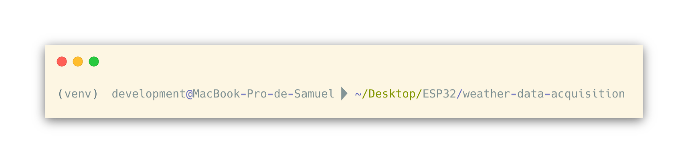
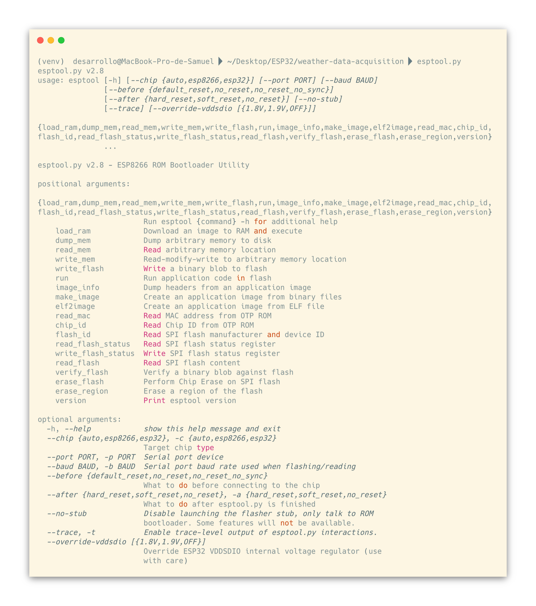
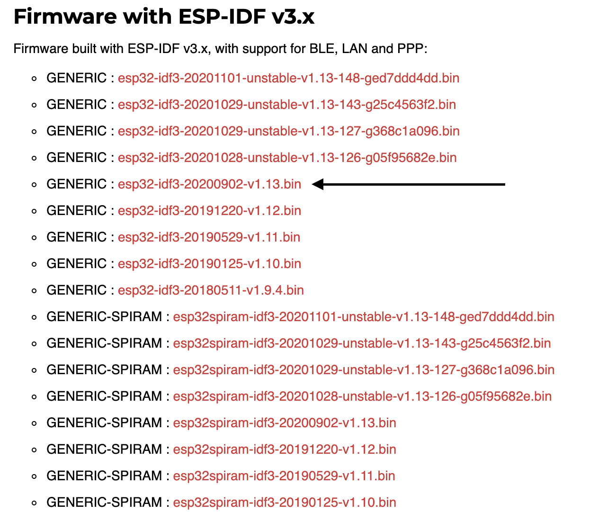
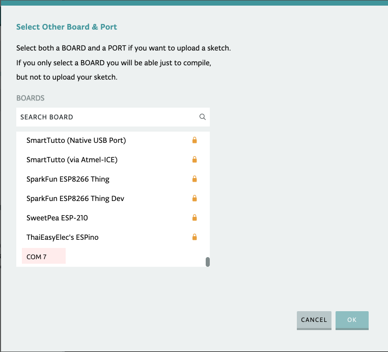

_It's all about choosing the right tool for the job..._

So first come first, as you may know by now for these project we're going to use three main components:

- [ESP32 or ESP8266 Micro](https://www.amazon.com/ESP-WROOM-32-desarrollo-procesador-microcontrolador-amplificadora/dp/B0718T232Z/ref=sr_1_1_sspa?dchild=1&keywords=ESP32&qid=1604191170&sr=8-1-spons&psc=1&spLa=ZW5jcnlwdGVkUXVhbGlmaWVyPUExMTZBMTUzQlFPUkFSJmVuY3J5cHRlZElkPUEwNzY4MjUxMkoyVVNaUko1TDBGVyZlbmNyeXB0ZWRBZElkPUEwMjA4NDMxMk8zUVNWVlRSVEExTiZ3aWRnZXROYW1lPXNwX2F0ZiZhY3Rpb249Y2xpY2tSZWRpcmVjdCZkb05vdExvZ0NsaWNrPXRydWU=)
- [DHT11 Sensor](https://www.amazon.com/-/es/DHT11-humedad-temperatura-Raspberry-unidades/dp/B07WT2HJ4F/ref=sr_1_5?__mk_es_US=%C3%85M%C3%85%C5%BD%C3%95%C3%91&dchild=1&keywords=dht11&qid=1604191194&sr=8-5)
- [Webhooks Webapp](https://ifttt.com/maker_webhooks)

To begin with we're goign to use [MicroPython](https://micropython.org/) for Embedded Software Programming because of three reasons:

1. Is a **Human-Readable** language, any developer that has written code in C (and to add more gravity, C for embedded systems) knows how hard, and sometimes, impossible to comprehend this language can be. But no worries, we won't deal with that complexity, that's what MycroPython's for.

2. When we talk about embedded systems is almost impossible not to think about objects, we are sorrounded by them and makes a lot of sense to write code that fits to that need, since MicroPython is Python based we can safely say that is an **Object Oriented Language** which will give us all that syntactic sugar and all those characteristics such as polymorphism or inheritance.

3. **Built-In Exception and Error-Handling**, I think there isn't much more to add on top of this, good luck trying to make a try/except in C.

Don't take me wrong, C is a very powerful tool but as we said before... our mantra for this project is _choosing the right tool for the job_.

Alright!, let's begin with the most important part of the project, that is setting up our environment. To write code in MicroPython I've found two options which I'll name but only will explain one of them, simply because I found that one to be far more user friendly than the other.

First option is **uPyCraft IDE**, for those who find this tool more convinient I'll leave a [link](https://maker.pro/esp8266/tutorial/using-micropython-on-an-esp8266-with-upycraft) to a post that'll help you through the process.

Second option, and the one that I'll use through out the whole project, is [**Thonny IDE**](https://thonny.org/). It allows us to program our ESP32 or ESP8266 boards with MicroPython, and it is compatible with Windows, Mac OS X, and Linux.

## Let's download and flash the firmware

For this purpose we will use esptool.py library, we will be following the post from randomnerdtutorials on [How to Flash MicroPython Firmware with esptool.py on ESP32 and ESP8266](https://randomnerdtutorials.com/flashing-micropython-firmware-esptool-py-esp32-esp8266/) if you have any doubts in what we may be doing you can always refer to that link, there you'll find great troubleshooting tips and a lot of help from the community.

These steps will work either on Linux, Windows or MacOS:

### Installing esptool.py in your computer

###### Note: Python 3.7.X is recommended, if you don't have it installed go to [Python’s](https://www.python.org/downloads/) website and install it in your computer.

Open your terminal and as part of good practices create a folder with the name of your project and then create a virtual environment with the following command.

```bash
mkdir weather-data-acquisition && cd weather-data-acquisition && python3 -m virtualenv venv
```

Now, let's begin out virtual environment:

```bash
source venv/bin/activate
```

We should have something like this in our terminal:



Now let's install esptool.py in our virtual environments with pip:

```bash
pip install esptool
```

If it throws an error you might wanna check if you have pip installed on your virtual environment or try with one of the following commands: `pip3 install esptool`, `python -m pip install esptool`, `pip2 install esptool`.

If it was successfully installed you should be able to run `esptool.py` in your terminal and get the following output:



Now we can easily flash our ESP32 or ESP8266.

Let's download the latest version of MicroPython firmware for the ESP32, to do so go to the [MicroPython Website](https://micropython.org/download/esp32/) and download the latest stable version, or click [here](https://micropython.org/resources/firmware/esp32-idf3-20200902-v1.13.bin).



#### Find the Serial Port Name

To find the Serial Port Name there's an easy way to do so and is by using the Arduino IDE:

1. Connect your board to your computer (**make sure you're using a cable with data wires**)
2. Open the Arduino IDE
3. Go to Tools > Port
4. Check the ESP32 Serial Port Name.



###### Reason why your IDE looks different than mine is because I'm using website version since I don't have installed on my PC.

#### Erase ESP32 Flash Memory

Before flashing the MicroPython firmware, you need to erase the ESP32 flash memory. So, with your ESP32 connected to your computer, hold-down the “BOOT/FLASH” button in your ESP32 board:

While holding down the “BOOT/FLASH” button, run the following command to erase the ESP32 flash memory:

```bash
esptool.py --chip esp32 erase_flash
```

When the “Erasing” process begins, you can release the “BOOT/FLASH” button. After a few seconds, the ESP32 flash memory will be erased.
