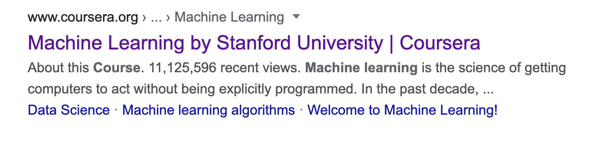

About five months ago, I was lying in my bed, just harking the wind and thinking all those futile questions that generally lead nowhere—those types of questions that every beginner programmer makes to himself.

The question that resonated the most was **what I should learn now?** I had just “finished” learning C, had some prior experience with javascript and web development, and also, for my thesis at the university, I was forced to learn Python. My head was like a giant sea of knowledge... with two inches in depth. But there I was, thinking about _learning_ new tech. The idea came to me like lightning, let’s get into Machine Learning. I had no clue that it was going to be both difficult and beneficial because the notion that I had on machine learning was at the other corner of what it turned out to be; let me break down this little journey into smaller pieces:

## Mysticism

**Machines learning stuff**, sounds cool huh? It is certainly not magic, and it has to be programmed somehow. Someone must overcome inertia and give an initial instruction. But how is it done? How can someone say to his computer, “I need you to learn this for me, can you?“. So my first step into this journey was wiping out mysticism. I tried with many resources and spent weeks trying to find good guides that were well suited for me, from[Lidgi Gonzalez](https://www.youtube.com/watch?v=4c7oFu36d6k&list=PLJjOveEiVE4Dk48EI7I-67PEleEC5nxc3&index=1) to [Tech with Tim](https://www.youtube.com/watch?v=ujTCoH21GlA&list=PLzMcBGfZo4-mP7qA9cagf68V06sko5otr). Keep in mind that I’m not trying to discourage people from using those resources; I’m pretty sure that those are good enough for lots of folks out there. However, I’m more of a theoretical-practical guy. So I ended up doing a simple search at google:

And there it was, like water in the desert. My first step into Machine Learning, [Andrew Ng](https://www.coursera.org/learn/machine-learning) started this course and finished it in about a month and a half. It allowed me to understand the basics, what was happening under the hood. But that taste of salt wouldn’t leave my mouth, which led me to the second piece of the journey.

## Determination

Learning can be fascinating but is, leastwise, exhausting. I had to decide whether to keep circumventing things without really committing to anything or finally take responsibility and start to take things seriously. I made up my mind and decided to keep up, so I started this second course at [Kaggle](https://www.kaggle.com/learn/intro-to-machine-learning). It was amazing. I was excited, so I made the [third one](https://www.coursera.org/learn/linear-algebra-machine-learning/home/welcome) and the [fourth one](https://www.coursera.org/learn/gcp-big-data-ml-fundamentals-es/home/welcome). After that, I thought **this is it**, the moment to start making all this knowledge profitable, and what a big surprise.

## Reality check

I started applying for data science positions at some companies, but _"reality check"_ **THEY WOULD NOT HIRE ME, AND MANY OF THEM WOULD NOT EVEN CALL ME**. So I started wondering why?. It was devastating, but what a humbling experience. Five months of learning a new thing don’t build an expert. I wasn’t ready (I’m still not), and I didn’t want to accept that.

## Not giving up

So I came back to my books, this time with more determination than ever. I shook off my sadness and started with [Daniel Bourke Roadmap](https://www.mrdbourke.com/2020-machine-learning-roadmap/). I’m currently reading the [Hands on Machine Learning](https://github.com/yanshengjia/ml-road/blob/master/resources/Hands%20On%20Machine%20Learning%20with%20Scikit%20Learn%20and%20TensorFlow.pdf) book, which is fantastic, doing some projects with [Streamlit](https://www.streamlit.io/), learning a lot [Scala](https://www.scala-lang.org) with [ZIO](https://zio.dev) and preparing some posts about what I’ve learned in this short but enriching journey. I can’t say that it wasn’t worth it just because a particular company didn’t call me back. On the opposite, it has shown me that I can have a firm determination to do things to set up goals and try my best to accomplish them.

I know I’ve reduced my possibilities a little. I’m not doing web programming that much, or C as I used to, but I’ve done something way more significant and much more meaningful: **I found my passion**.

For those that are at the beginning of their journey, my piece of advice is don’t despair. Be humble, and keep your goals in mind. I’m pretty confident that it will sooner or later pay off.
