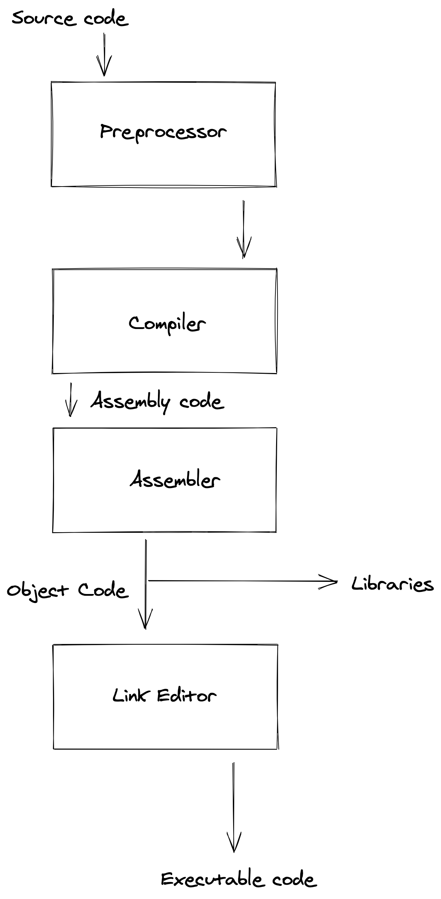

The method of human communication, either spoken or written, consists of using words in a structured way, with a set of basic written (or unwritten) rules that we all know and commonly agree on. That's the reason why languages like Python, Ruby, and many more have had such a huge impact on our daily basis
because they remind us that way of communicating.

But where did all these high-level languages came from? Well let me introduce you the grandparent of them all **C Programming Language**.

What I intend to do in this post is explain (or at least try to) what's the process behind the code we write.

It's pretty simple to write our first [_hello world_](https://blog.hackerrank.com/the-history-of-hello-world/) in C, but how on earth does my computer reads it?!

### Binaries

Back when I was in college I remember being in classes of microcontrollers and microprocessors, being totally honest with you all... those were not my favorites. All our professor would do is talk about an old microprocessor ([Intel 8086](https://en.wikipedia.org/wiki/Intel_8086))
model. I didn't know or even realized how much of an impact that little guy had and has up until these [days](https://www.youtube.com/watch?v=ZVnaklkMVt4). What I would think all the time is yet another assembly code yet another grade to pass, and that was it. Luckily, before graduation, I got an
internship in a pretty big company in the department of telecommunications... I was shocked!


I would love to tell you about that experience but that will be a topic for another post. Very quickly I noticed that my understanding of how computers was incomplete. I knew _"everything"_ about signals, how transistors do their magic, how a signal is processed
and treated but something was missing, how does my computer understand whatever I write... and as curious as man can be I made my homework.

After writing our first C program all we do is running the magic gcc command and that's it, right?

```bash
gcc main.c
```

Well that's not it, let's have a closer look at what the stages of this process are:



### Preprocessing:

The first stage of compilation is called preprocessing. In this stage, lines that start with a pound(_#_) character are interpreted by the preprocessor as _preprocessor_ commands, also all comments in the code are deleted. Hence this commands are replaced by the source code itself:

```c
#include <stdio.h> — Here will be pasted in the standard library I/O file
```

If we used to have this:

```c
#include <stdio.h>
/**
* main - Entry point
*
* Return: Always0 on success
*/

int main(int argc, char **argv){
    printf("With proper grammar, but the outcome is a piece of art\n");
    return (0);
}
```

Now we will have:

```c
FILE *funopen(const void *,
                 int (* _Nullable)(void *, char *, int),
                 int (* _Nullable)(void *, const char *, int),
                 fpos_t (* _Nullable)(void *, fpos_t, int),
                 int (* _Nullable)(void *));
# 407 "/Applications/Xcode.app/Contents/Developer/Platforms/MacOSX.platform/Developer/SDKs/MacOSX.sdk/usr/include/stdio.h" 3 4
# 1 "/Applications/Xcode.app/Contents/Developer/Platforms/MacOSX.platform/Developer/SDKs/MacOSX.sdk/usr/include/secure/_stdio.h" 1 3 4
# 31 "/Applications/Xcode.app/Contents/Developer/Platforms/MacOSX.platform/Developer/SDKs/MacOSX.sdk/usr/include/secure/_stdio.h" 3 4
# 1 "/Applications/Xcode.app/Contents/Developer/Platforms/MacOSX.platform/Developer/SDKs/MacOSX.sdk/usr/include/secure/_common.h" 1 3 4
# 32 "/Applications/Xcode.app/Contents/Developer/Platforms/MacOSX.platform/Developer/SDKs/MacOSX.sdk/usr/include/secure/_stdio.h" 2 3 4
# 42 "/Applications/Xcode.app/Contents/Developer/Platforms/MacOSX.platform/Developer/SDKs/MacOSX.sdk/usr/include/secure/_stdio.h" 3 4
extern int __sprintf_chk (char * restrict, int, size_t,
     const char * restrict, ...);
# 52 "/Applications/Xcode.app/Contents/Developer/Platforms/MacOSX.platform/Developer/SDKs/MacOSX.sdk/usr/include/secure/_stdio.h" 3 4
extern int __snprintf_chk (char * restrict, size_t, int, size_t,
      const char * restrict, ...);


extern int __vsprintf_chk (char * restrict, int, size_t,
      const char * restrict, va_list);


extern int __vsnprintf_chk (char * restrict, size_t, int, size_t,
       const char * restrict, va_list);
# 408 "/Applications/Xcode.app/Contents/Developer/Platforms/MacOSX.platform/Developer/SDKs/MacOSX.sdk/usr/include/stdio.h" 2 3 4
# 19 "main.c" 2


int main(int argc, char **argv){
 printf("With proper grammar, but the outcome is a piece of art\n");
 return (0);
}
```

_And 300 more lines on top of this of unnecessary gibberish for this post... You get the point!_

Don't panic!.

As we can see we no longer have comments nor the `#include<stdio.h>` statement. It was replaced by the actual `stdio.h` code.

### Assembly:

An assembler is used to translate the assembly instructions to object code. The output are instructions to be run by your processor.
(_I would put the code but it would be better if I put this link so you guys see why I didn't do it 😅 [Binary code translation](https://www.qbit.it/lab/bintext.php)_)

### Linking:

If a source file references a functions defined in another source files the link editor combines the code to create an executable file. The linker will look for the `main()` function to mark it as the starting point of the executable.

And those are the stages, I would love to go more in depth on the process of how the circuitry actually uses those binaries resulting from this process but that will a topic for another post. Very

Until then just be graceful because nor you neither me had to do that dirty work in order to have our beautiful _hello world_...
